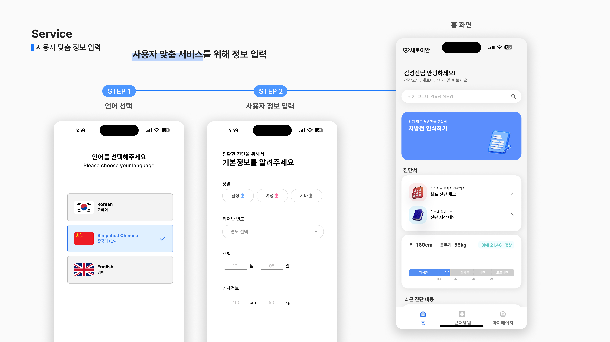
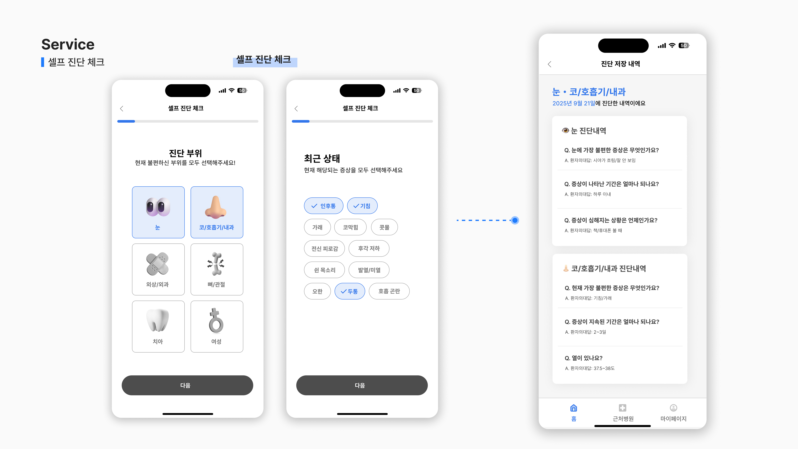

## 실행방법
- **프론트엔드:**
  1) 프론트엔드 Repository를 Git 클론하기
  2) 의존성 패키지 설치하기: [bash] npm install 또는 yarn install
  3) 환경 변수 설정:
   .env 파일 생성
   cp .env.example .env
   `.env` 파일을 열어 다음 항목들을 설정하세요:
   BACKEND_API_URL=http://your-backend-url:8000
   SUPABASE_URL=your-supabase-url
   SUPABASE_ANON_KEY=your-supabase-anon-key
   ... 기타 필요한 환경 변수
   환경 변수 값 획득 방법: 프로젝트 관리자에게 문의
  4) Expo 개발 서버 실행
  [bash]
  npx expo start
  5) 모바일 기기에서 앱 실행
  개발 서버가 시작되면 터미널에 QR 코드가 표시됩니다.
   
   **iOS의 경우:**
   - App Store에서 **Expo Go** 앱 설치
   - iPhone 기본 카메라로 QR 코드 스캔
   - 표시되는 알림을 탭하여 Expo Go에서 앱 열기
   
   **Android의 경우:**
   - Play Store에서 **Expo Go** 앱 설치
   - Expo Go 앱 내의 "Scan QR Code" 기능으로 스캔
   - 또는 터미널에서 `a` 키를 눌러 Android 에뮬레이터에서 실행

   > **참고**: 모바일 기기와 개발 PC가 같은 Wi-Fi 네트워크에 연결되어 있어야 합니다.
  6) **개발 중 유용한 명령어**
   - `r`: 앱 새로고침
   - `m`: 개발자 메뉴 열기
   - `Ctrl + C`: 개발 서버 종료

- **백엔드:**
  1) AWS에서 관리자가 EC2 인스턴스 실행
  2) EC2 인스턴스 접속
      ssh -i your-key.pem ubuntu@your-ec2-ip
  3) 서비스 상태 확인
      sudo systemctl status saeroi-an-backend
  4) **서버 시작/재시작:**
    [bash]
    #서버 시작
    sudo systemctl start saeroi-an-backend
    #서버 재시작 (코드 업데이트 후)
    sudo systemctl restart saeroi-an-backend
  7) #로그 확인
  sudo journalctl -u saeroi-an-backend -f

  **코드 배포 (업데이트):**
```[bash]
# EC2 접속 후
cd /path/to/backend
git pull origin main
source venv/bin/activate
pip install -r requirements.txt
sudo systemctl restart saeroi-fastapi
```

> **참고**: EC2 인스턴스는 비용 절감을 위해 사용하지 않을 때 중지할 수 있습니다.
> AWS Console에서 인스턴스를 시작/중지하거나, 담당자에게 문의하세요.
---------------------------------------------------------------------------------

# 새로이 안(安)

당신의 편안한 진료를 위해, <br>
사용자 맞춤 AI 의료 서비스 

---

## 🌐 소개 (Overview)

새로이 + 편안할 안(安)

한국에 체류하고 있는 외국인을 위한 의료서비스입니다. <br>
더 이상 어렵게 한국어로 이야기하지 않아도 돼요. <br>
새로이 안으로 간편하게 본인의 증상을 전달해보세요!<br>
사용자 정보를 기반으로 처방전 인식, 셀프 진단 체크, 주변 정보를 제공받습니다. <br>

---

## 🌐 공모전 (Contest)


'인공지능(AI), 충북의 미래를 디자인하다'<br>
전국 ICT 융합 공모전을 함께 준비하고있습니다. 

---

## 🌐 기능 (Features)






## 🌐 주요 기능 (Features)
- 사용자 정보 입력 및 관리
- AI 기반 처방전 인식 및 채팅
- 셀프 진단 체크
- 다국어 지원 (한국어 / 중국어 / 영어)
- React Native + FastAPI 연동 구조

## 🌐 AI 모델 (AI)
- base model: [Qwen2-vl-2B-instruct](https://github.com/QwenLM/Qwen3-VL)
- LoRA 파인튜닝: [참고 url](https://github.com/2U1/Qwen-VL-Series-Finetune)
- hugging face: [Rfy23/qwen2vl-ko-zh](https://huggingface.co/Rfy23/qwen2vl-ko-zh)


---

## 🌐 기술 스택 (Tech Stack)
| 분류 | 사용 기술 |
|------|------------|
| Frontend | React Native (Expo), JavaScript |
| Backend | FastAPI, Python, PostgreSQL |
| Database | Supabase |
| AI | Hugging Face, Qwen2-VL-2B-Instruct |
| Deployment | AWS S3, Ngrok |
